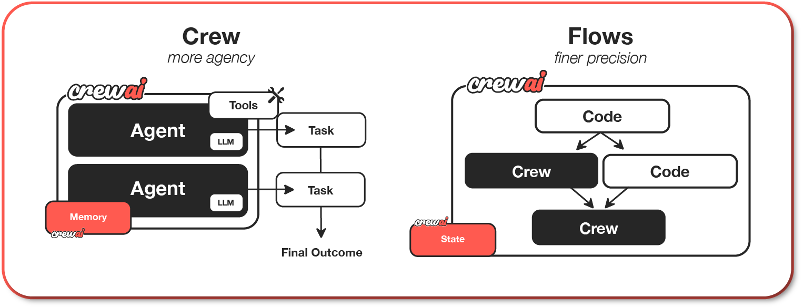

<p align="center">
  <a href="https://github.com/your-org/human.exe">
    
  </a>
</p>
<p align="center" style="display: flex; justify-content: center; gap: 20px; align-items: center;">
  <a href="https://trendshift.io/repositories/00000" target="_blank">
    
  </a>
</p>

<p align="center">
  <a href="https://humanexe.dev">Homepage</a>
  ·
  <a href="https://humanexe.dev/open-source">Open Source</a>
  ·
  <a href="https://docs.humanexe.dev">Docs</a>
  ·
  <a href="https://app.humanexe.dev">Start Cloud Trial</a>
  ·
  <a href="https://blog.humanexe.dev">Blog</a>
  ·
  <a href="https://community.humanexe.dev">Forum</a>
</p>

<p align="center">
  <a href="https://github.com/your-org/human.exe">
    
  </a>
  <a href="https://github.com/your-org/human.exe/network/members">
    
  </a>
  <a href="https://github.com/your-org/human.exe/issues">
    
  </a>
  <a href="https://github.com/your-org/human.exe/pulls">
    
  </a>
  <a href="https://opensource.org/licenses/MIT">
    
  </a>
</p>

<p align="center">
  <a href="https://pypi.org/project/human-exe/">
    
  </a>
  <a href="https://pypi.org/project/human-exe/">
    
  </a>
  <a href="https://x.com/humanexe">
    
  </a>
</p>

### human.exe: Supervised AI Digital Labor Platform

> human.exe is a supervised AI digital labor system for production environments.
> It combines autonomous multi-agent execution with human governance, auditability, and policy enforcement.

- **Supervised Agent Workflows**: Run autonomous workflows with explicit human approval gates.
- **Governed Execution**: Enforce policy-aware execution, decision diffs, immutable audit trails, and trace visibility.

human.exe is designed for organizations that need real AI operations with accountability, control, and enterprise-ready governance.

# human.exe Control Plane

For teams that need safe and scalable AI operations, human.exe provides a control plane for supervised execution, monitoring, compliance, and operational reliability.

The platform includes a supervisor console, workforce analytics controls, and human-in-the-loop approval workflows.

## human.exe Key Features:

- **Tracing & Observability**: Monitor and track your AI agents and workflows in real-time, including metrics, logs, and traces.
- **Unified Control Plane**: A centralized platform for managing, monitoring, and scaling your AI agents and workflows.
- **Seamless Integrations**: Easily connect with existing enterprise systems, data sources, and cloud infrastructure.
- **Advanced Security**: Built-in robust security and compliance measures ensuring safe deployment and management.
- **Actionable Insights**: Real-time analytics and reporting to optimize performance and decision-making.
- **24/7 Support**: Dedicated enterprise support to ensure uninterrupted operation and quick resolution of issues.
- **On-premise and Cloud Deployment Options**: Deploy human.exe on-premise or in the cloud, depending on your security and compliance requirements.

human.exe is designed for enterprises seeking a reliable way to transform complex business processes into supervised,
traceable AI-enabled operations.

## Table of contents

- [Build with AI](#build-with-ai)
- [Human.exe Supervisor Console](#humanexe-supervisor-console)
- [Why human.exe?](#why-humanexe)
- [Getting Started](#getting-started)
- [Key Features](#key-features)
- [Understanding Agent Teams and Workflows](#understanding-agent-teams-and-workflows)
- [Examples](#examples)
  - [Quick Tutorial](#quick-tutorial)
  - [Write Job Descriptions](#write-job-descriptions)
  - [Trip Planner](#trip-planner)
  - [Stock Analysis](#stock-analysis)
  - [Using Agent Teams and Workflows Together](#using-agent-teams-and-workflows-together)
- [Connecting human.exe to a Model](#connecting-humanexe-to-a-model)
- [When to Use human.exe](#when-to-use-humanexe)
- [Contribution](#contribution)
- [Telemetry](#telemetry)
- [License](#license)
- [Frequently Asked Questions (FAQ)](#frequently-asked-questions-faq)

## Build with AI

Using an AI coding agent? Use this repository to build and iterate on human.exe workflows, supervision policies, and workforce transformation agents.

**Claude Code:**
```shell
/plugin marketplace add your-org/human-exe-skills
/plugin install human-exe-skills@humanexe-plugins
/reload-plugins
```
Four skills that activate automatically when you ask relevant workflow and orchestration questions:

| Skill | When it runs |
|-------|--------------|
| `getting-started` | Scaffolding new projects, choosing between `LLM.call()` / `Agent` / `Crew` / `Flow`, wiring `crew.py` / `main.py` |
| `design-agent` | Configuring agents — role, goal, backstory, tools, LLMs, memory, guardrails |
| `design-task` | Writing task descriptions, dependencies, structured output (`output_pydantic`, `output_json`), human review |
| `ask-docs` | Querying the docs MCP server for up-to-date API details |

**Cursor, Codex, Windsurf, and others ([skills.sh](https://skills.sh/your-org/human-exe-skills)):**
```shell
npx skills add your-org/human-exe-skills
```

This installs structured skills that help coding agents scaffold flows, configure agents, design tasks, and follow repository conventions.

## Human.exe Supervisor Console

This repository includes a supervised digital labor layer under `human_exe/` with:

- RBAC-gated supervisor console API and web UI
- Human approval queue with approve/modify/reject decisions
- Audit and trace artifact integration
- Workforce HR analytics mode that requires manual supervisor approval

### Run the supervisor console

```shell
uv run python -m human_exe.supervisor_console_main --host 127.0.0.1 --port 8765
```

Default users are configured in `human_exe/config/supervisor_users.yaml`:

- `admin` / `admin` (role: `supervisor`)
- `auditor` / `auditor` (role: `auditor`)

### Manual HR analytics approval flow

When enabling workforce HR analytics mode through `WorkforceDataAgent`, use console API approval mode to require a real human decision in the UI queue.

1. Log in to the console with `POST /api/login` and obtain a bearer token.
2. Call `WorkforceDataAgent.ingest(..., hr_analytics_mode=True, use_console_api_approval=True, ...)`.
3. The request appears in the supervisor queue (`HR_ANALYTICS_MODE_REQUEST`).
4. A supervisor approves/rejects/modifies in the web UI.
5. Ingestion proceeds only after an approving decision; rejection or timeout raises `PermissionError`.

Example:

```python
from pathlib import Path

from human_exe.workforce.agents.workforce_data_agent import WorkforceDataAgent

agent = WorkforceDataAgent()
records = agent.ingest(
  Path("company_workforce.csv"),
  hr_analytics_mode=True,
  use_console_api_approval=True,
  console_api_base_url="http://127.0.0.1:8765",
  console_api_token="<bearer-token>",
  approval_timeout_seconds=120,
)
```

#### Quickstart script (curl login + token)

```shell
# 1) Login and save response.
curl -sS -X POST "http://127.0.0.1:8765/api/login" \
  -H "Content-Type: application/json" \
  -d '{"username":"admin","password":"admin"}' > /tmp/humanexe-login.json

# 2) Extract bearer token from login JSON.
TOKEN=$(python -c "import json; print(json.load(open('/tmp/humanexe-login.json'))['token'])")

# 3) Verify token by reading the supervisor queue.
curl -sS "http://127.0.0.1:8765/api/queue" \
  -H "Authorization: Bearer $TOKEN"
```

Use the token in your ingestion call as `console_api_token`. Once ingestion requests HR analytics mode, approve it in the web console queue to let processing continue.

#### Quickstart script (PowerShell + Invoke-RestMethod)

```powershell
# 1) Login and get session payload.
$session = Invoke-RestMethod -Method POST -Uri "http://127.0.0.1:8765/api/login" `
  -ContentType "application/json" `
  -Body '{"username":"admin","password":"admin"}'

# 2) Extract bearer token.
$token = $session.token

# 3) Verify token by reading the supervisor queue.
Invoke-RestMethod -Method GET -Uri "http://127.0.0.1:8765/api/queue" `
  -Headers @{ Authorization = "Bearer $token" }
```

Use `$token` as your `console_api_token` when calling `WorkforceDataAgent.ingest(...)` with `use_console_api_approval=True`.

## Why human.exe?

<div align="center" style="margin-bottom: 30px;">
  
</div>

human.exe unlocks the true potential of multi-agent automation, delivering speed, flexibility, and control through Crews of AI agents and event-driven Flows:

- **Purpose-built architecture**: Designed specifically for agent orchestration, with a lightweight Python core and clean primitives for real-world automation.
- **High Performance**: Optimized for speed and minimal resource usage, enabling faster execution.
- **Flexible Low-Level Customization**: Complete freedom to customize everything from workflows and system architecture to agent behaviors, internal prompts, and execution logic.
- **Ideal for Every Use Case**: Proven effective for simple tasks, complex workflows, and production-grade automation.
- **Robust Community**: Backed by a rapidly growing community of over **100,000 certified** developers offering comprehensive support and resources.

human.exe empowers developers and teams to build intelligent automations that balance simplicity, flexibility, and production-grade control.

## Getting Started

Setup and run your first human.exe agents by following this tutorial.

[](https://www.youtube.com/watch?v=-kSOTtYzgEw "human.exe Getting Started Tutorial")

###

Learning Resources

Learn human.exe through our comprehensive courses:

- [Multi AI Agent Systems with human.exe](https://www.deeplearning.ai/short-courses/multi-ai-agent-systems-with-human-exe/) - Master the fundamentals of multi-agent systems
- [Practical Multi AI Agents and Advanced Use Cases](https://www.deeplearning.ai/short-courses/practical-multi-ai-agents-and-advanced-use-cases-with-human-exe/) - Deep dive into advanced implementations

### Understanding Agent Teams and Workflows

human.exe offers two powerful, complementary approaches that work seamlessly together to build sophisticated AI applications:

1. **Crews**: Teams of AI agents with true autonomy and agency, working together to accomplish complex tasks through role-based collaboration. Crews enable:

   - Natural, autonomous decision-making between agents
   - Dynamic task delegation and collaboration
   - Specialized roles with defined goals and expertise
   - Flexible problem-solving approaches

2. **Flows**: Production-ready, event-driven workflows that deliver precise control over complex automations. Flows provide:

   - Fine-grained control over execution paths for real-world scenarios
   - Secure, consistent state management between tasks
   - Clean integration of AI agents with production Python code
   - Conditional branching for complex business logic

The true power of human.exe emerges when combining Crews and Flows. This synergy allows you to:

- Build complex, production-grade applications
- Balance autonomy with precise control
- Handle sophisticated real-world scenarios
- Maintain clean, maintainable code structure

### Getting Started with Installation

To get started with human.exe, follow these simple steps:

### 1. Installation

Ensure you have Python >=3.10 <3.14 installed on your system. human.exe uses [UV](https://docs.astral.sh/uv/) for dependency management and package handling, offering a seamless setup and execution experience.

First, install human.exe:

```shell
uv pip install human-exe
```

If you want to install the 'human-exe' package along with its optional features that include additional tools for agents, you can do so by using the following command:

```shell
uv pip install 'human-exe[tools]'
```

The command above installs the basic package and also adds extra components which require more dependencies to function.

### Troubleshooting Dependencies

If you encounter issues during installation or usage, here are some common solutions:

#### Common Issues

1. **ModuleNotFoundError: No module named 'tiktoken'**

   - Install tiktoken explicitly: `uv pip install 'human-exe[embeddings]'`
   - If using embedchain or other tools: `uv pip install 'human-exe[tools]'`

2. **Failed building wheel for tiktoken**

   - Ensure Rust compiler is installed (see installation steps above)
   - For Windows: Verify Visual C++ Build Tools are installed
   - Try upgrading pip: `uv pip install --upgrade pip`
   - If issues persist, use a pre-built wheel: `uv pip install tiktoken --prefer-binary`

### 2. Setting Up Your Workforce Project with YAML Configuration

To create a new human.exe project, run the following CLI (Command Line Interface) command:

```shell
human-exe create workforce <project_name>
```

This command creates a new project folder with the following structure:

```
my_project/
├── .gitignore
├── pyproject.toml
├── README.md
├── .env
└── src/
    └── my_project/
        ├── __init__.py
        ├── main.py
        ├── crew.py
        ├── tools/
        │   ├── custom_tool.py
        │   └── __init__.py
        └── config/
            ├── agents.yaml
            └── tasks.yaml
```

You can now start developing your crew by editing the files in the `src/my_project` folder. The `main.py` file is the entry point of the project, the `crew.py` file is where you define your crew, the `agents.yaml` file is where you define your agents, and the `tasks.yaml` file is where you define your tasks.

#### To customize your project, you can:

- Modify `src/my_project/config/agents.yaml` to define your agents.
- Modify `src/my_project/config/tasks.yaml` to define your tasks.
- Modify `src/my_project/crew.py` to add your own logic, tools, and specific arguments.
- Modify `src/my_project/main.py` to add custom inputs for your agents and tasks.
- Add your environment variables into the `.env` file.

#### Example of a simple crew with a sequential process:

Instantiate your crew:

```shell
human-exe create workforce latest-ai-development
```

Modify the files as needed to fit your use case:

**agents.yaml**

```yaml
# src/my_project/config/agents.yaml
researcher:
  role: >
    {topic} Senior Data Researcher
  goal: >
    Uncover cutting-edge developments in {topic}
  backstory: >
    You're a seasoned researcher with a knack for uncovering the latest
    developments in {topic}. Known for your ability to find the most relevant
    information and present it in a clear and concise manner.

reporting_analyst:
  role: >
    {topic} Reporting Analyst
  goal: >
    Create detailed reports based on {topic} data analysis and research findings
  backstory: >
    You're a meticulous analyst with a keen eye for detail. You're known for
    your ability to turn complex data into clear and concise reports, making
    it easy for others to understand and act on the information you provide.
```

**tasks.yaml**

````yaml
# src/my_project/config/tasks.yaml
research_task:
  description: >
    Conduct a thorough research about {topic}
    Make sure you find any interesting and relevant information given
    the current year is 2025.
  expected_output: >
    A list with 10 bullet points of the most relevant information about {topic}
  agent: researcher

reporting_task:
  description: >
    Review the context you got and expand each topic into a full section for a report.
    Make sure the report is detailed and contains any and all relevant information.
  expected_output: >
    A fully fledge reports with the mains topics, each with a full section of information.
    Formatted as markdown without '```'
  agent: reporting_analyst
  output_file: report.md
````

**crew.py**

```python
# src/my_project/crew.py
from human_exe import Agent, Crew, Process, Task
from human_exe.project import CrewBase, agent, crew, task
from human_exe_tools import SerperDevTool
from human_exe.agents.agent_builder.base_agent import BaseAgent
from typing import List

@CrewBase
class LatestAiDevelopmentCrew():
	"""LatestAiDevelopment crew"""
	agents: List[BaseAgent]
	tasks: List[Task]

	@agent
	def researcher(self) -> Agent:
		return Agent(
			config=self.agents_config['researcher'],
			verbose=True,
			tools=[SerperDevTool()]
		)

	@agent
	def reporting_analyst(self) -> Agent:
		return Agent(
			config=self.agents_config['reporting_analyst'],
			verbose=True
		)

	@task
	def research_task(self) -> Task:
		return Task(
			config=self.tasks_config['research_task'],
		)

	@task
	def reporting_task(self) -> Task:
		return Task(
			config=self.tasks_config['reporting_task'],
			output_file='report.md'
		)

	@crew
	def crew(self) -> Crew:
		"""Creates the LatestAiDevelopment crew"""
		return Crew(
			agents=self.agents, # Automatically created by the @agent decorator
			tasks=self.tasks, # Automatically created by the @task decorator
			process=Process.sequential,
			verbose=True,
		)
```

**main.py**

```python
#!/usr/bin/env python
# src/my_project/main.py
import sys
from latest_ai_development.crew import LatestAiDevelopmentCrew

def run():
    """
    Run the crew.
    """
    inputs = {
        'topic': 'AI Agents'
    }
    LatestAiDevelopmentCrew().crew().kickoff(inputs=inputs)
```

### 3. Running Your Workforce Project

Before running your crew, make sure you have the following keys set as environment variables in your `.env` file:

- An [OpenAI API key](https://platform.openai.com/account/api-keys) (or other LLM API key): `OPENAI_API_KEY=sk-...`
- A [Serper.dev](https://serper.dev/) API key: `SERPER_API_KEY=YOUR_KEY_HERE`

Lock the dependencies and install them by using the CLI command but first, navigate to your project directory:

```shell
cd my_project
human-exe install (Optional)
```

To run your crew, execute the following command in the root of your project:

```bash
human-exe run
```

or

```bash
python src/my_project/main.py
```

If an error happens due to the usage of poetry, please run the following command to update your human-exe package:

```bash
human-exe update
```

You should see the output in the console and the `report.md` file should be created in the root of your project with the full final report.

In addition to the sequential process, you can use the hierarchical process, which automatically assigns a manager to the defined crew to properly coordinate the planning and execution of tasks through delegation and validation of results. [See more about the processes here](https://docs.humanexe.dev/core-concepts/Processes/).

## Key Features

human.exe gives developers a practical foundation for building agentic systems that move from prototype to production: autonomous collaboration where it helps, explicit workflow control where it matters, and Python-native customization throughout.

- **Crews for autonomy**: Model teams of specialized AI agents with roles, goals, tools, and tasks.
- **Flows for control**: Build event-driven workflows with state, branching, routing, and production logic.
- **Seamless integration**: Combine Crews and Flows to create complex, real-world automations.
- **Python-native customization**: Customize prompts, tools, execution paths, state, and integrations without fighting the framework.
- **Agent-ready capabilities**: Use tools, memory, knowledge, checkpointing, async execution, and MCP/A2A support for more capable production agents.
- **Production-ready patterns**: Add deterministic steps, human input, structured outputs, and checkpointing as your system grows.
- **Thriving community**: Backed by robust documentation and over 100,000 certified developers, providing exceptional support and guidance.

Choose human.exe to build powerful, adaptable, and production-ready AI automations.

## Examples

You can test different real life examples of AI crews in the [human.exe-examples repo](https://github.com/your-org/human-exe-examples?tab=readme-ov-file):

- [Landing Page Generator](https://github.com/your-org/human-exe-examples/tree/main/crews/landing_page_generator)
- [Having Human input on the execution](https://docs.humanexe.dev/how-to/Human-Input-on-Execution)
- [Trip Planner](https://github.com/your-org/human-exe-examples/tree/main/crews/trip_planner)
- [Stock Analysis](https://github.com/your-org/human-exe-examples/tree/main/crews/stock_analysis)

### Quick Tutorial

[](https://www.youtube.com/watch?v=tnejrr-0a94 "human.exe Tutorial")

### Write Job Descriptions

[Check out code for this example](https://github.com/your-org/human-exe-examples/tree/main/crews/job-posting) or watch a video below:

[](https://www.youtube.com/watch?v=u98wEMz-9to "Jobs postings")

### Trip Planner

[Check out code for this example](https://github.com/your-org/human-exe-examples/tree/main/crews/trip_planner) or watch a video below:

[](https://www.youtube.com/watch?v=xis7rWp-hjs "Trip Planner")

### Stock Analysis

[Check out code for this example](https://github.com/your-org/human-exe-examples/tree/main/crews/stock_analysis) or watch a video below:

[](https://www.youtube.com/watch?v=e0Uj4yWdaAg "Stock Analysis")

### Using Agent Teams and Workflows Together

human.exe's power truly shines when combining Crews with Flows to create sophisticated automation pipelines.
human.exe flows support logical operators like `or_` and `and_` to combine multiple conditions. This can be used with `@start`, `@listen`, or `@router` decorators to create complex triggering conditions.

- `or_`: Triggers when any of the specified conditions are met.
- `and_`Triggers when all of the specified conditions are met.

Here's how you can orchestrate multiple Crews within a Flow:

```python
from human_exe.flow.flow import Flow, listen, start, router, or_
from human_exe import Crew, Agent, Task, Process
from pydantic import BaseModel

# Define structured state for precise control
class MarketState(BaseModel):
    sentiment: str = "neutral"
    confidence: float = 0.0
    recommendations: list = []

class AdvancedAnalysisFlow(Flow[MarketState]):
    @start()
    def fetch_market_data(self):
        # Demonstrate low-level control with structured state
        self.state.sentiment = "analyzing"
        return {"sector": "tech", "timeframe": "1W"}  # These parameters match the task description template

    @listen(fetch_market_data)
    def analyze_with_crew(self, market_data):
        # Show crew agency through specialized roles
        analyst = Agent(
            role="Senior Market Analyst",
            goal="Conduct deep market analysis with expert insight",
            backstory="You're a veteran analyst known for identifying subtle market patterns"
        )
        researcher = Agent(
            role="Data Researcher",
            goal="Gather and validate supporting market data",
            backstory="You excel at finding and correlating multiple data sources"
        )

        analysis_task = Task(
            description="Analyze {sector} sector data for the past {timeframe}",
            expected_output="Detailed market analysis with confidence score",
            agent=analyst
        )
        research_task = Task(
            description="Find supporting data to validate the analysis",
            expected_output="Corroborating evidence and potential contradictions",
            agent=researcher
        )

        # Demonstrate crew autonomy
        analysis_crew = Crew(
            agents=[analyst, researcher],
            tasks=[analysis_task, research_task],
            process=Process.sequential,
            verbose=True
        )
        return analysis_crew.kickoff(inputs=market_data)  # Pass market_data as named inputs

    @router(analyze_with_crew)
    def determine_next_steps(self):
        # Show flow control with conditional routing
        if self.state.confidence > 0.8:
            return "high_confidence"
        elif self.state.confidence > 0.5:
            return "medium_confidence"
        return "low_confidence"

    @listen("high_confidence")
    def execute_strategy(self):
        # Demonstrate complex decision making
        strategy_crew = Crew(
            agents=[
                Agent(role="Strategy Expert",
                      goal="Develop optimal market strategy")
            ],
            tasks=[
                Task(description="Create detailed strategy based on analysis",
                     expected_output="Step-by-step action plan")
            ]
        )
        return strategy_crew.kickoff()

    @listen(or_("medium_confidence", "low_confidence"))
    def request_additional_analysis(self):
        self.state.recommendations.append("Gather more data")
        return "Additional analysis required"
```

This example demonstrates how to:

1. Use Python code for basic data operations
2. Create and execute Crews as steps in your workflow
3. Use Flow decorators to manage the sequence of operations
4. Implement conditional branching based on Crew results

## Connecting human.exe to a Model

human.exe supports using various LLMs through a variety of connection options. By default your agents will use the OpenAI API when querying the model. However, there are several other ways to allow your agents to connect to models. For example, you can configure your agents to use a local model via the Ollama tool.

Please refer to the [Connect human.exe to LLMs](https://docs.humanexe.dev/how-to/LLM-Connections/) page for details on configuring your agents' connections to models.

## When to Use human.exe

Use human.exe when you need more than a single prompt or chatbot: multi-step work, specialized agents, tool use, structured outputs, human review, or workflows that combine autonomous reasoning with explicit business logic.

human.exe is especially useful when you want to:

- Coordinate multiple agents with clear roles and tasks.
- Wrap agent work in deterministic, event-driven workflows.
- Keep application logic in regular Python.
- Move from experiment to production without changing frameworks.
- Add tools, memory, checkpointing, and async execution as your system grows.

## Contribution

human.exe is open-source and we welcome contributions. If you're looking to contribute, please:

- Fork the repository.
- Create a new branch for your feature.
- Add your feature or improvement.
- Send a pull request.
- We appreciate your input!

### Contributing to the docs

The site at [docs.human-exe.com](https://docs.humanexe.dev) is published from
`docs/` by [Mintlify](https://www.mintlify.com/). The docs use directory-based
versioning: edits to `docs/edge/<lang>/...` (e.g.
`docs/edge/en/concepts/agents.mdx`) land under the **Edge** version selector
immediately and are frozen into a new versioned snapshot under
`docs/v<X.Y.Z>/` at the next release cut. Frozen snapshots are immutable — CI
rejects PRs that modify them without a `[docs-freeze]` title prefix. The
release CLI (`devtools release`) handles the freeze automatically; see
[`AGENTS.md`](AGENTS.md) for the full contributor guide and
[`RELEASING.md`](RELEASING.md) for the release-cut runbook.

### Installing Dependencies

```bash
uv lock
uv sync
```

### Virtual Env

```bash
uv venv
```

### Pre-commit hooks

```bash
pre-commit install
```

### Running Tests

```bash
uv run pytest .
```

### Running static type checks

```bash
uvx mypy src
```

### Packaging

```bash
uv build
```

### Installing Locally

```bash
uv pip install dist/*.tar.gz
```

## Telemetry

human.exe uses anonymous telemetry to collect usage data with the main purpose of helping us improve the library by focusing our efforts on the most used features, integrations and tools.

It's pivotal to understand that **NO data is collected** concerning prompts, task descriptions, agents' backstories or goals, usage of tools, API calls, responses, any data processed by the agents, or secrets and environment variables, with the exception of the conditions mentioned. When the `share_crew` feature is enabled, detailed data including task descriptions, agents' backstories or goals, and other specific attributes are collected to provide deeper insights while respecting user privacy. Users can disable telemetry by setting the environment variable OTEL_SDK_DISABLED to true.

Data collected includes:

- Version of human.exe
  - So we can understand how many users are using the latest version
- Version of Python
  - So we can decide on what versions to better support
- General OS (e.g. number of CPUs, macOS/Windows/Linux)
  - So we know what OS we should focus on and if we could build specific OS related features
- Number of agents and tasks in a crew
  - So we make sure we are testing internally with similar use cases and educate people on the best practices
- Crew Process being used
  - Understand where we should focus our efforts
- If Agents are using memory or allowing delegation
  - Understand if we improved the features or maybe even drop them
- If Tasks are being executed in parallel or sequentially
  - Understand if we should focus more on parallel execution
- Language model being used
  - Improved support on most used languages
- Roles of agents in a crew
  - Understand high level use cases so we can build better tools, integrations and examples about it
- Tools names available
  - Understand out of the publicly available tools, which ones are being used the most so we can improve them

Users can opt-in to Further Telemetry, sharing the complete telemetry data by setting the `share_crew` attribute to `True` on their Crews. Enabling `share_crew` results in the collection of detailed crew and task execution data, including `goal`, `backstory`, `context`, and `output` of tasks. This enables a deeper insight into usage patterns while respecting the user's choice to share.

## License

human.exe is released under the [MIT License](https://github.com/your-org/human.exe/blob/main/LICENSE).

## Frequently Asked Questions (FAQ)

### General

- [What exactly is human.exe?](#q-what-exactly-is-human-exe)
- [How do I install human.exe?](#q-how-do-i-install-human-exe)
- [Is human.exe a standalone framework?](#q-is-human-exe-a-standalone-framework)
- [Is human.exe open-source?](#q-is-human-exe-open-source)
- [Does human.exe collect data from users?](#q-does-human-exe-collect-data-from-users)

### Features and Capabilities

- [Can human.exe handle complex use cases?](#q-can-human-exe-handle-complex-use-cases)
- [Can I use human.exe with local AI models?](#q-can-i-use-human-exe-with-local-ai-models)
- [What makes Crews different from Flows?](#q-what-makes-crews-different-from-flows)
- [Does human.exe support fine-tuning or training custom models?](#q-does-human-exe-support-fine-tuning-or-training-custom-models)

### Resources and Community

- [Where can I find real-world human.exe examples?](#q-where-can-i-find-real-world-human-exe-examples)
- [How can I contribute to human.exe?](#q-how-can-i-contribute-to-human-exe)

### Enterprise Features

- [What additional features does human.exe AMP offer?](#q-what-additional-features-does-human-exe-amp-offer)
- [Is human.exe AMP available for cloud and on-premise deployments?](#q-is-human-exe-amp-available-for-cloud-and-on-premise-deployments)
- [Can I try human.exe AMP for free?](#q-can-i-try-human-exe-amp-for-free)

### Q: What exactly is human.exe?

A: human.exe is a lean, fast Python framework built specifically for orchestrating autonomous AI agents and production-ready agentic workflows.

### Q: How do I install human.exe?

A: Install human.exe using pip:

```shell
uv pip install human-exe
```

For additional tools, use:

```shell
uv pip install 'human-exe[tools]'
```

### Q: Is human.exe a standalone framework?

A: Yes. human.exe is a standalone Python framework with its own primitives for agents, tasks, crews, flows, tools, and orchestration.

### Q: Can human.exe handle complex use cases?

A: Yes. human.exe excels at both simple and highly complex real-world scenarios, offering deep customization options at both high and low levels, from internal prompts to sophisticated workflow orchestration.

### Q: Can I use human.exe with local AI models?

A: Absolutely! human.exe supports various language models, including local ones. Tools like Ollama and LM Studio allow seamless integration. Check the [LLM Connections documentation](https://docs.humanexe.dev/how-to/LLM-Connections/) for more details.

### Q: What makes Crews different from Flows?

A: Crews provide autonomous agent collaboration, ideal for tasks requiring flexible decision-making and dynamic interaction. Flows offer precise, event-driven control, ideal for managing detailed execution paths and secure state management. You can seamlessly combine both for maximum effectiveness.

### Q: Is human.exe open-source?

A: Yes, human.exe is open-source and actively encourages community contributions and collaboration.

### Q: Does human.exe collect data from users?

A: human.exe collects anonymous telemetry data strictly for improvement purposes. Sensitive data such as prompts, tasks, or API responses are never collected unless explicitly enabled by the user.

### Q: Where can I find real-world human.exe examples?

A: Check out practical examples in the [human.exe-examples repository](https://github.com/your-org/human-exe-examples), covering use cases like trip planners, stock analysis, and job postings.

### Q: How can I contribute to human.exe?

A: Contributions are warmly welcomed! Fork the repository, create your branch, implement your changes, and submit a pull request. See the Contribution section of the README for detailed guidelines.

### Q: What additional features does human.exe AMP offer?

A: human.exe AMP provides advanced features such as a unified control plane, real-time observability, secure integrations, advanced security, actionable insights, and dedicated 24/7 enterprise support.

### Q: Is human.exe AMP available for cloud and on-premise deployments?

A: Yes, human.exe AMP supports both cloud-based and on-premise deployment options, allowing enterprises to meet their specific security and compliance requirements.

### Q: Can I try human.exe AMP for free?

A: Yes, you can explore part of the human.exe AMP Suite by accessing the [Crew Control Plane](https://app.humanexe.dev) for free.

### Q: Does human.exe support fine-tuning or training custom models?

A: Yes, human.exe can integrate with custom-trained or fine-tuned models, allowing you to enhance your agents with domain-specific knowledge and accuracy.

### Q: Can human.exe agents interact with external tools and APIs?

A: Absolutely! human.exe agents can easily integrate with external tools, APIs, and databases, empowering them to leverage real-world data and resources.

### Q: Is human.exe suitable for production environments?

A: Yes, human.exe is designed with production-grade patterns that support reliable, stable, and scalable agentic workflows.

### Q: How scalable is human.exe?

A: human.exe is highly scalable, supporting simple automations and large-scale workflows involving numerous agents and complex tasks simultaneously.

### Q: Does human.exe offer debugging and monitoring tools?

A: Yes, human.exe AMP includes advanced debugging, tracing, and real-time observability features, simplifying the management and troubleshooting of your automations.

### Q: What programming languages does human.exe support?

A: human.exe is primarily Python-based but easily integrates with services and APIs written in any programming language through its flexible API integration capabilities.

### Q: Does human.exe offer educational resources for beginners?

A: Yes, human.exe provides extensive beginner-friendly tutorials, courses, and documentation through learn.human-exe.com, supporting developers at all skill levels.

### Q: Can human.exe automate human-in-the-loop workflows?

A: Yes, human.exe fully supports human-in-the-loop workflows, allowing seamless collaboration between human experts and AI agents for enhanced decision-making.

